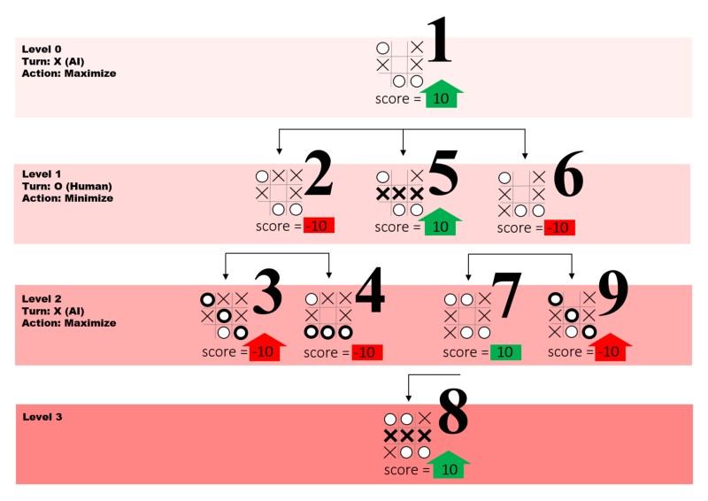
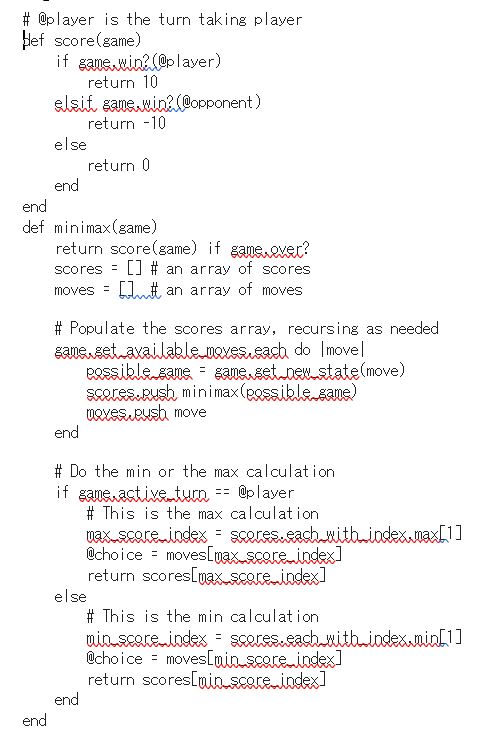

# Tic-Tac-Toe-with-AI
**Aim:** To implement Tic-Tac-Toe using min-max algorithm.

**Theory**

Minimax is a decision rule used in artificial intelligence, decision theory, game theory, statistics and philosophy for minimizing the possible loss for a worst case (maximum loss) scenario. When dealing with gains, it is referred to as &#39;maximin&#39; - to maximize the minimum gain. Originally formulated for two-player zero-sum game-theory, covering both the cases where players take alternate moves and those where they make simultaneous moves, it has also been extended to more complex games and to general decision-making in the presence of uncertainty.

`Minimax is a kind of backtracking algorithm that is used in decision making and game theory to find the optimal move for a player, assuming that your opponent also plays optimally. It is widely used in two player turn based games such as Tic-Tac-Toe, Backgammon, Mancala, Chess, etc.`

`In minimax the two players are called maximizer and minimizer. The minimizer tries to get the highest score possible while the maximizer tries to do the opposite and get the lowest score possible.`

`Every board has a value associated with it. In a given state if the maximizer has upper hand the, the score of the board will tend to be some positive value.`

`If the minimizer has the upper hand in that board state then it will tend to be some negative value. The values of the board are calculated by some heuristics which are unique for every type of game.`

**Algorithm**

